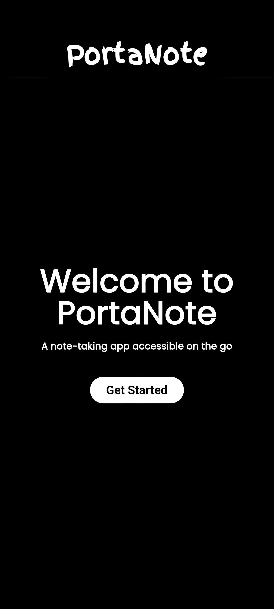
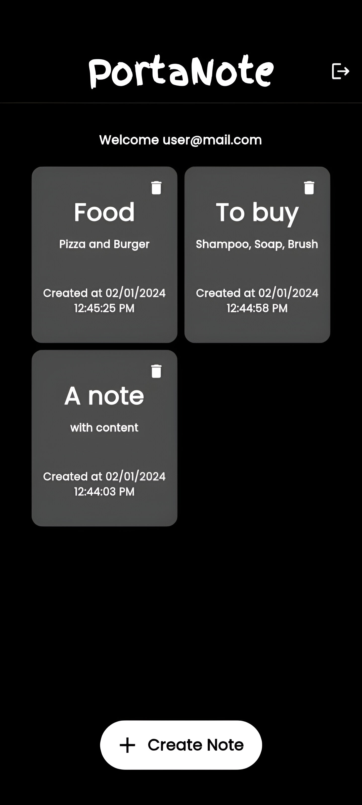
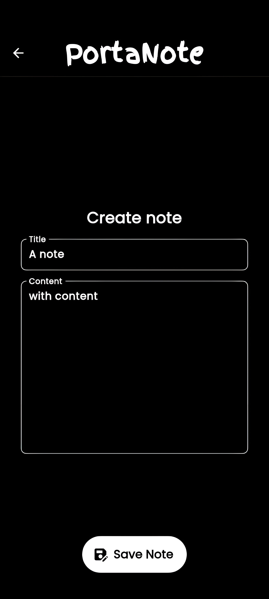
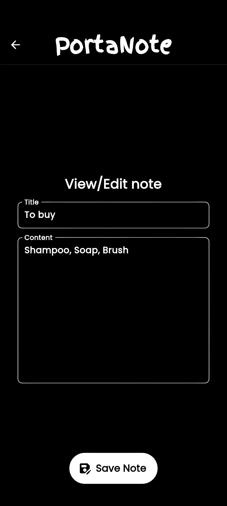

 

  

  <h3 align="center">PortaNote App</h3>

  

    A note-taking app accessible on the go
     
     
    <a href="https://github.com/SakshhamTheCoder/PortaNote-App/issues">Report Bug</a>
    .
    <a href="https://github.com/SakshhamTheCoder/PortaNote-App/issues">Request Feature</a>
  

  

## Table Of Contents

-   [About the Project](#about-the-project)
-   [Built With](#built-with)
-   [Getting Started](#getting-started)
-   [Usage](#usage)
-   [Contributing](#contributing)
-   [License](#license)
-   [Authors](#authors)
-   [Acknowledgements](#acknowledgements)

## About The Project

PortaNote is yet another note-taking app made with the help of Firebase as a backend service. This repository implements the frontend for the Android/iOS app using Flutter.

Key Features:

-   Create unlimited notes with a title and content
-   Edit existing notes if required to change the title or content
-   Notes are sorted according to the modified time of the note
-   Delete notes if not required
-   Uses a beautiful monochromatic theme for ease of use
-   Powerful and secure authorization. Thanks to Firebase.

## Built With

-   [Firebase](https://firebase.google.com)
-   [Flutter](https://flutter.dev/)
-   [Google Fonts](https://fonts.google.com/)
-   [Material Icons](https://fonts.google.com/icons)

## Getting Started

To install this app, download the app binary from release tab and install it on your phone

## Usage

Sign up or Sign in to the app using your email and password. Then, you can create notes by pressing the Create Note button below. You can view/edit your notes by pressing on one note card which opens another window where you can modify.

## Contributing

Contributions are what make the open source community such an amazing place to be learn, inspire, and create. Any contributions you make are **greatly appreciated**.

-   If you have suggestions for adding or removing projects, feel free to [open an issue](https://github.com/SakshhamTheCoder/PortaNote-App/issues/new) to discuss it, or directly create a pull request after you edit the _README.md_ file with necessary changes.
-   Please make sure you check your spelling and grammar.
-   Create individual PR for each suggestion.
-   Please also read through the [Code Of Conduct](https://github.com/SakshhamTheCoder/PortaNote-App/blob/main/CODE_OF_CONDUCT.md) before posting your first idea as well.

### Creating A Pull Request

1. Fork the Project
2. Create your Feature Branch (`git checkout -b feature/AmazingFeature`)
3. Commit your Changes (`git commit -m 'Add some AmazingFeature'`)
4. Push to the Branch (`git push origin feature/AmazingFeature`)
5. Open a Pull Request

## License

Distributed under the MIT License. See [LICENSE](https://github.com/SakshhamTheCoder/PortaNote-App/blob/main/LICENSE.md) for more information.

## Authors

-   **Sakshham Bhagat** - [Sakshham Bhagat](https://github.com/SakshhamTheCoder)

 
<h3 align="center">
Thank you
</h3>
